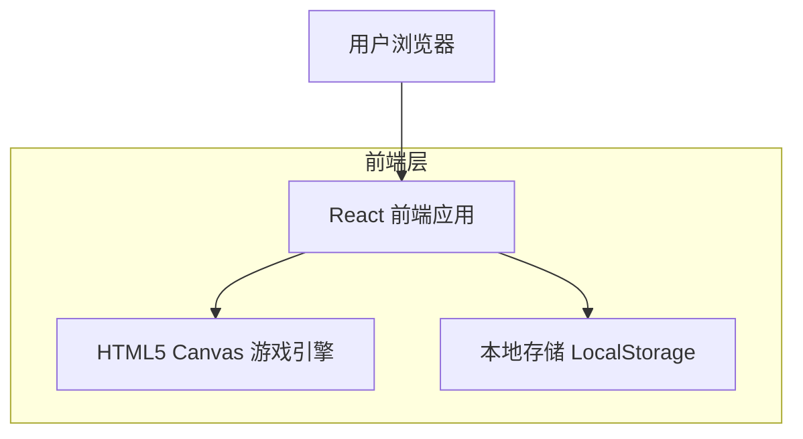
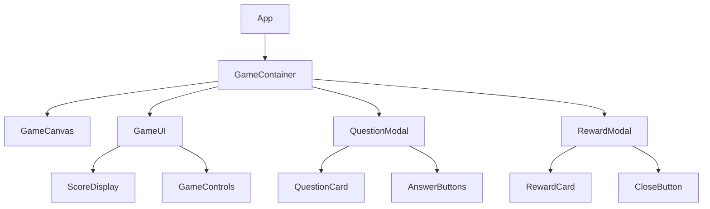
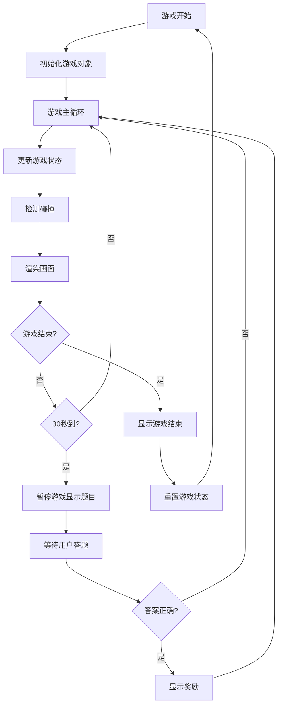

# Flappy Bird 手机网页游戏技术架构文档

## 1. 架构设计



## 2. 技术描述

* 前端：React\@18 + TypeScript + Vite + Tailwind CSS

* 游戏引擎：HTML5 Canvas + 自定义游戏循环

* 数据存储：LocalStorage（存储最高分等游戏数据）

* 后端：无需后端服务

## 3. 路由定义

| 路由 | 用途                     |
| -- | ---------------------- |
| /  | 游戏主页面，包含完整的游戏界面和所有交互功能 |

## 4. 核心组件架构

### 4.1 组件层次结构



### 4.2 核心类设计

```typescript
// 游戏状态管理
interface GameState {
  isPlaying: boolean;
  isPaused: boolean;
  score: number;
  highScore: number;
  gameTime: number;
  bird: Bird;
  pipes: Pipe[];
  showQuestion: boolean;
  showReward: boolean;
}

// 小鸟对象
class Bird {
  x: number;
  y: number;
  velocity: number;
  gravity: number;
  jumpForce: number;
  
  update(): void;
  jump(): void;
  draw(ctx: CanvasRenderingContext2D): void;
}

// 管道对象
class Pipe {
  x: number;
  topHeight: number;
  bottomHeight: number;
  width: number;
  gap: number;
  
  update(): void;
  draw(ctx: CanvasRenderingContext2D): void;
  checkCollision(bird: Bird): boolean;
}

// 选择题数据
interface Question {
  id: string;
  question: string;
  options: string[];
  correctAnswer: number;
}

// 奖励数据
interface Reward {
  id: string;
  title: string;
  content: string;
  emoji: string;
}
```

## 5. 游戏循环架构



## 6. 数据模型

### 6.1 本地存储数据结构

```typescript
// LocalStorage 数据结构
interface GameData {
  highScore: number;
  totalPlayTime: number;
  questionsAnswered: number;
  correctAnswers: number;
  settings: {
    soundEnabled: boolean;
    vibrationEnabled: boolean;
  };
}
```

### 6.2 游戏配置常量

```typescript
// 游戏配置
const GAME_CONFIG = {
  CANVAS_WIDTH: 400,
  CANVAS_HEIGHT: 600,
  BIRD_SIZE: 30,
  PIPE_WIDTH: 60,
  PIPE_GAP: 150,
  GRAVITY: 0.5,
  JUMP_FORCE: -8,
  PIPE_SPEED: 2,
  QUESTION_INTERVAL: 30000, // 30秒
  REWARD_DISPLAY_TIME: 3000, // 3秒
};

// 示例题目数据
const SAMPLE_QUESTIONS: Question[] = [
  {
    id: '1',
    question: '世界上最高的山峰是？',
    options: ['珠穆朗玛峰', '乞力马扎罗山', '富士山', '泰山'],
    correctAnswer: 0
  },
  // 更多题目...
];

// 示例奖励数据
const SAMPLE_REWARDS: Reward[] = [
  {
    id: '1',
    title: '有趣事实',
    content: '蜂鸟是唯一能够向后飞行的鸟类！',
    emoji: '🐦'
  },
  // 更多奖励...
];
```

## 7. 性能优化策略

* 使用 requestAnimationFrame 实现流畅的游戏循环

* 对象池技术复用管道对象，减少垃圾回收

* Canvas 离屏渲染优化背景和静态元素

* 事件节流处理触摸输入，避免过度响应

* 懒加载题目和奖励数据，减少初始加载时间

* 使用 Web Workers 处理复杂计算（如碰撞检测优化）

