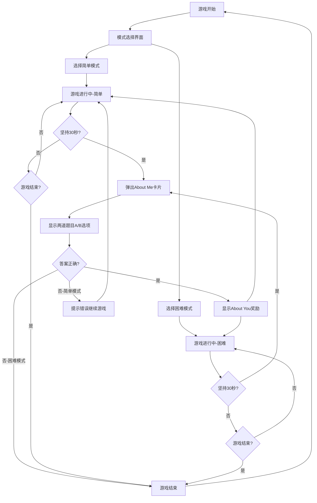

# Flappy Bird 手机网页游戏产品需求文档

## 1. 产品概述
一款在手机网页浏览器上直接运行的 Flappy Bird 游戏，融合了个人互动元素。玩家在游戏过程中每坚持30秒会遇到About Me选择题挑战，答对后获得About You奖励。

游戏提供简单模式和困难模式两种难度，旨在通过互动问答增进彼此了解，适合朋友、情侣或家人之间的趣味互动。

## 2. 核心功能

### 2.1 游戏模式
游戏提供两种模式供玩家选择：

| 模式 | 答错处理 | 难度特点 |
|------|----------|----------|
| 简单模式 | 提示答错，继续游戏 | 适合轻松娱乐，容错性高 |
| 困难模式 | 游戏结束，重新开始 | 增加挑战性，需要更专注 |

### 2.2 功能模块
游戏包含以下核心页面：
1. **模式选择界面**：简单模式、困难模式选择按钮
2. **游戏主界面**：游戏画布、操作控制、分数显示
3. **About Me弹窗**：两道题目卡片、选项A/B按钮
4. **About You奖励弹窗**：奖励内容卡片、关闭按钮

### 2.3 页面详情

| 页面名称 | 模块名称 | 功能描述 |
|----------|----------|----------|
| 模式选择界面 | 模式选择 | 提供简单模式和困难模式选择，显示模式说明 |
| 游戏主界面 | 游戏画布 | 显示小鸟、管道、背景动画，处理触摸/点击控制 |
| 游戏主界面 | 分数系统 | 实时显示当前分数、最高分数、游戏时长、当前模式 |
| 游戏主界面 | 游戏控制 | 开始/暂停/重新开始按钮，返回模式选择按钮 |
| About Me弹窗 | 题目展示 | 同时显示两道题目，每题提供选项A和选项B |
| About Me弹窗 | 交互控制 | 处理选项点击，显示答题结果，错误提示（简单模式） |
| About You奖励弹窗 | 奖励内容 | 显示"恭喜获得随机掉落About You"及具体内容 |
| About You奖励弹窗 | 关闭控制 | 提供关闭按钮，自动关闭计时器 |

## 3. 核心流程

用户打开网页后首先进入模式选择界面，选择简单模式或困难模式后进入游戏主界面。点击屏幕开始游戏，小鸟在重力作用下下落，用户通过点击屏幕让小鸟向上飞行，避开管道障碍。每坚持30秒，游戏暂停并弹出About Me卡片，显示两道题目，每题有选项A和选项B。用户选择答案后，如果正确则显示"恭喜获得随机掉落About You"奖励并继续游戏；如果错误，简单模式会提示错误并继续游戏，困难模式则游戏结束重新开始。

## 4. 用户界面设计

### 4.1 设计风格
- 主色调：天蓝色 (#87CEEB) 和草绿色 (#90EE90)
- 辅助色：橙色 (#FFA500) 用于按钮和强调元素
- 按钮样式：圆角矩形，带阴影效果
- 字体：系统默认字体，标题 24px，正文 16px
- 布局风格：卡片式设计，居中对齐
- 图标风格：简洁的卡通风格，使用表情符号增加趣味性

### 4.2 页面设计概览

| 页面名称 | 模块名称 | UI 元素 |
|----------|----------|----------|
| 模式选择界面 | 模式选择 | 两个大按钮：简单模式（绿色）、困难模式（红色），带模式说明文字 |
| 游戏主界面 | 游戏画布 | 全屏 Canvas，蓝色渐变背景，绿色管道，黄色小鸟 |
| 游戏主界面 | 分数显示 | 顶部居中白色大字体分数，右上角显示当前模式和最高分 |
| 游戏主界面 | 控制按钮 | 底部居中圆形开始按钮，暂停按钮，返回模式选择按钮 |
| About Me弹窗 | 题目卡片 | 白色圆角卡片，标题"About Me"，同时显示两道题目 |
| About Me弹窗 | 选项按钮 | 每题两个按钮：选项A（蓝色）、选项B（橙色），点击后变色反馈 |
| About You奖励弹窗 | 奖励卡片 | 金色渐变背景，标题"恭喜获得随机掉落About You"，掉落动画效果 |

### 4.3 响应式设计
游戏采用移动优先设计，主要适配手机竖屏模式。游戏画布自适应屏幕尺寸，弹窗组件在不同屏幕上保持合适的比例和可读性。支持触摸操作优化，按钮区域足够大以便手指点击。